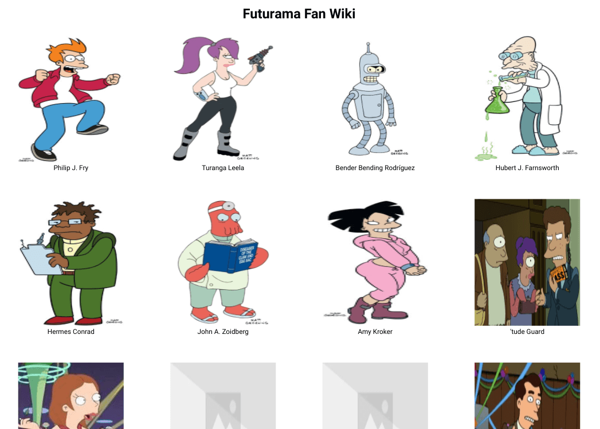

<h1 align="center">Futurama Fan Wiki</h1>

   Solution to a challenge from <a href="https://50reactprojects.com/" target="_blank">50 react projects for the static web</a>.

## Table of Contents

- [Overview](#overview)
  - [Built With](#built-with)
  - [Thoughts](#thoughts)
- [Requirements](#requirements)
- [Improvements](#improvements)
- [Useful Resources](#useful-resources)

## Overview

[Live Link](https://jdegand.github.io/futurama-fan-wiki)

### Built With

- React
- React Router v6

### Thoughts

- Weird that all keys from the api are uppercased.
- Sometimes pics don't load
- No updates since 2020 
- each character doesn't have an id
- fetching all characters link is limited to 20? 

- Airtable would be good to use to create own api from another show
- don't have to create separate api and host on heroku

- Hard to find apis that include pictures 
- Project structure similar to sfpopos project 

- If you refresh on detail page, won't display - state is not persisted
- sfpopos project had a duplicated data fetch to display data in detail page

- Added sessionStorage but you have to accept a cookie for it to work
- sessionStorage logic led to duplicated code - didn't explore all options to clean up

## Requirements 

- [x] Create a character wiki using an API that lists out all of the characters of your favorite TV series
- [x] Add dynamic pages to the character wiki allowing people to navigate to characters to view more information
- [ ] Use some of the characteristics of the TV show to make the character wiki look like it belongs in that TV universe with custom styles and animations

### Improvements

- styling / accessibility
- eliminate duplicated code
- futurama api itself

## Useful Resources

- [Make School](https://makeschool.org/mediabook/oa/tutorials/react-fundamentals-vm0/setting-up-react/) - make school tutorial with (outdated) react router
- [Stack Overflow](https://stackoverflow.com/questions/57765453/on-refresh-the-state-value-is-lost-in-react-js) - refresh & state
- [Blog](https://felixgerschau.com/react-localstorage/) - react & localStorage
