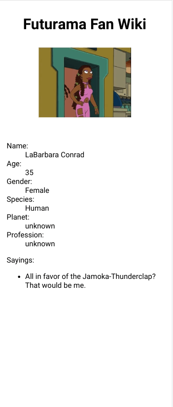

<h1 align="center">Futurama Fan Wiki</h1>

   Solution to a challenge from <a href="https://50reactprojects.com/" target="_blank">50 react projects for the static web</a>.

## Table of Contents

- [Overview](#overview)
  - [Screenshots](#screenshots)
  - [Link](#link)
  - [Built With](#built-with)
- [Requirements](#requirements)
- [Thoughts](#thoughts)
- [Improvements](#improvements)
- [Useful Resources](#useful-resources)

## Overview

### Screenshots

***

***

***

***

***

### Link

[Live Link](https://jdegand.github.io/futurama-fan-wiki/)

### Built With

- React
- React Router v6
- [Futurama api](https://sampleapis.com/api-list/futurama)

## Requirements 

- [x] Create a character wiki using an API that lists out all of the characters of your favorite TV series
- [x] Add dynamic pages to the character wiki allowing people to navigate to characters to view more information
- [ ] Use some of the characteristics of the TV show to make the character wiki look like it belongs in that TV universe with custom styles and animations

## Thoughts

- [Original Futurama Api](https://github.com/Katedam/futurama-api) has been updated and its' characters endpoint was deleted.   
- So I replaced that api with another [Futurama api](https://sampleapis.com/api-list/futurama). 
- The new api has a characters route and its json is similar to the previous api.  
- First Appearance, Status & VoicedBy properties do not exist on this new api so these properties are replaced by the new api's sayings property. 

- If you refresh on detail page, won't display anything - data is not persisted if cookie is blocked
- Api response is saved to sessionStorage to prevent another api request

- Added 'object-fit: contain' to the img tag - preserves the original aspect ratio and makes picture look better.  
- Use dictionary list for the card detail - reduced extra styling required if I were to use headings for propert name and spans/paragraphs for property details.   
- Added conditional to render 'unknown' if a property is missing a value or null
- Had to change original mobile design since I redesigned the card detail page 
- Homepage grid changes depending on screen width

## Improvements

- styling / accessibility
- eliminate duplicated code
- update dependencies -> react 18

## Useful Resources

- [Make School](https://makeschool.org/mediabook/oa/tutorials/react-fundamentals-vm0/setting-up-react/) - make school tutorial with (outdated) react router
- [Stack Overflow](https://stackoverflow.com/questions/57765453/on-refresh-the-state-value-is-lost-in-react-js) - refresh & state
- [Blog](https://felixgerschau.com/react-localstorage/) - react & localStorage
